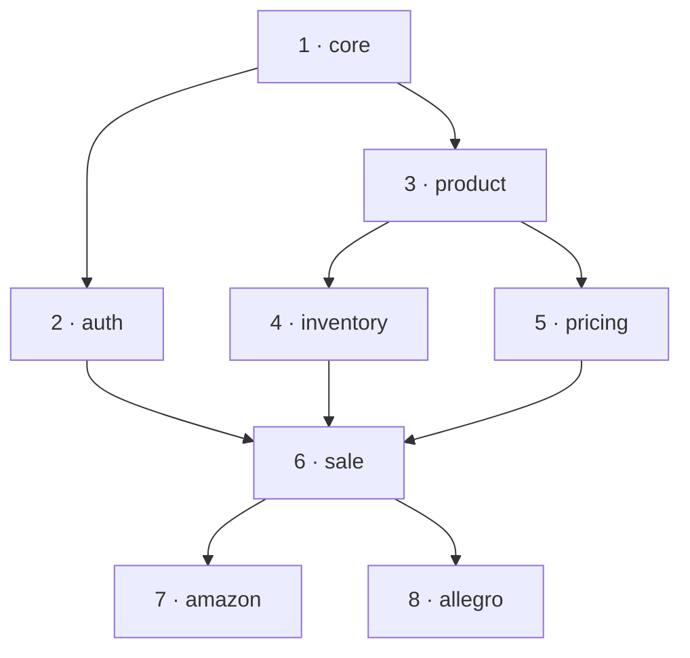

# Laravel True Modular

[](https://github.com/happenv-com/laravel-true-modular/actions)

**Make your Laravel architecture explicit, deterministic, and analyzable.**

Modules are first-class Composer packages with deterministic dependency ordering, an extended
lifecycle, and built-in architecture introspection. Instead of an architecture that lives only in
your team's heads, you get one you can query, graph, and reason about.

```
php artisan module:impact acme/catalog

acme/catalog

Direct:
  acme/checkout
  acme/pricing

Indirect:
  acme/storefront

Total affected: 3
```

> **Ask the codebase what a change touches before you make it.**

## Why

Large Laravel applications get harder to evolve over time. Modules end up depending on each other
silently, boot order becomes implicit, cross-module initialization is fragile, and the real shape of
the architecture survives only in the heads of the people who wrote it.

Laravel True Modular makes that shape explicit, and builds three guarantees on top of it:

1. **Topological provider ordering** — module service providers are sorted by their `composer.json`
   dependencies, so a module always boots after the modules it depends on. Cycles are detected and
   reported, not silently mis-ordered.
2. **Enhanced lifecycle** — `register() → initialize() → boot()`. The `initialize()` phase runs after
   every provider is registered but before *anything* boots — including third-party package
   providers. So your cross-module wiring (morph maps, permissions, drivers, Livewire/Filament hooks)
   is in place before any package's `boot()` reads it.
3. **Architecture introspection** — `module:graph`, `module:impact`, `module:why`, `module:list`,
   with `--format=json` so you can wire blast-radius checks into CI, and `--format=mermaid`/`dot` to
   render the graph.

## Where modules live

A module is just a Composer package whose `composer.json` declares `type: "true-module"`. That means
a module can live in either place:

- **Local to your app** — under the `app-modules/` directory, versioned alongside the rest of your
  code. This is where most modules start.
- **An external Composer package** — pulled in via `composer require` and resolved from `vendor/`
  like any dependency, so a module can be shared across applications or published privately.

Both are discovered the same way and take part in the same dependency ordering and tooling — there's
no difference in how they behave at runtime. The modules directory (default `app-modules`) and the
module type (default `true-module`) are configurable in `bootstrap/app.php` via
`Application::modulesDirectory()` and `Application::moduleComposerType()`.

## The module graph

Modules declare their dependencies in `composer.json` like any other Composer package. The package
reads those edges and derives both the **shape** of your system and the **exact order** things run.
Real graphs aren't a straight line — modules fan out and share dependencies. The number on each node
is its position in the deterministic boot order:



`module:graph` renders that as a tree — each module sits under the one it depends on. A module with
two dependencies (here `sale`) appears under each path that reaches it:

```
php artisan module:graph

core
├── auth
│   └── sale
│       ├── amazon
│       └── allegro
└── product
    ├── inventory
    │   └── sale
    │       ├── amazon
    │       └── allegro
    └── pricing
        └── sale
            ├── amazon
            └── allegro
```

`module:list` flattens it into the **deterministic execution order** — the exact, numbered sequence
in which providers `register()`, `initialize()`, and `boot()`, dependencies first:

```
php artisan module:list --simple

Modules in order (dependencies first):

  1. core
  2. auth
  3. product
  4. inventory
  5. pricing
  6. sale
  7. amazon
  8. allegro
```

No module ever boots before the modules it depends on — and a cycle is a hard error, not a
race condition. Other views of the same graph:

```bash
php artisan module:graph --format=mermaid # paste straight into a doc
php artisan module:graph --format=dot     # pipe into Graphviz
php artisan module:graph --root=sale      # restrict to one subtree
php artisan module:why amazon core        # shortest path: why does Amazon depend on Core?
```

## Enforcing boundaries (static analysis)

The runtime *discovers* and *explains* the architecture; a companion package
[**`happenv-com/laravel-true-modular-phpstan`**](https://github.com/happenv-com/laravel-true-modular-phpstan)
*enforces* it. It ships two zero-config PHPStan extensions:

- **Module Boundary Enforcer** — fails analysis when a module references a class from another module
  that isn't declared in its `composer.json` `require`, and detects circular dependencies between
  modules. It reads the same `composer.json` edges the framework uses to order providers, so there's
  nothing to configure.
- **Dynamic Relation Resolver** — types Eloquent relations registered at runtime (e.g. relations one
  module adds to another module's model via [model extensions](docs/model-extensions.md)), which are
  otherwise invisible to static analysis.

```bash
composer require --dev happenv-com/laravel-true-modular-phpstan
```

With [`phpstan/extension-installer`](https://github.com/phpstan/phpstan-extension-installer) both
extensions register automatically. See the
[package README](https://github.com/happenv-com/laravel-true-modular-phpstan) for details.

## Defining a module

A module is a Composer package (`type: "true-module"`) whose service provider extends
`ModuleProvider` and declares its features fluently:

```php
class CatalogServiceProvider extends ModuleProvider
{
    public function configureModule(Module $module): void
    {
        $module
            ->name('acme/catalog')
            ->hasConfig('catalog')
            ->hasRoutes('web', 'api')
            ->hasViews()
            ->hasMigrations()
            ->runsMigrations();
    }
}
```

## Extending existing modules

Modules don't only talk to each other through services — they can extend the **domain model itself**.
A downstream module adds attributes and relations to an upstream module's Eloquent model without
touching that model's class, so the dependency arrow stays pointed the right way.

The `billing` module declares the extension:

```php
$module->hasModelExtensions([
    Product::class => ProductBillingExtension::class,
]);
```

```php
final class ProductBillingExtension extends ModelExtension
{
    public function invoices(): HasMany
    {
        return $this->model->hasMany(Invoice::class);
    }
}
```

And `Product` gains the relation as if it were defined on it:

```php
Product::query()->with('invoices');
```

A sibling, `hasModelBuilderExtensions()`, does the same for an Eloquent **query builder** — the key
is the builder class to mix new query methods into, so a downstream module can teach an upstream
model's builder new scopes:

```php
$module->hasModelBuilderExtensions([
    ProductBuilder::class => ProductBillingQueries::class,
]);

Product::query()->withOutstandingInvoices()->get();
```

The `catalog` module that owns `Product` is never modified — `billing` contributes new attributes,
relations, and query methods to it. Each module composes the shared domain model instead of forking
or patching it. (Static analysis still sees these runtime additions, thanks to the
[PHPStan extension](#enforcing-boundaries-static-analysis) above.)

## Install

```bash
composer require happenv-com/laravel-true-modular
```

The one non-obvious step: the package ships a custom `Application` that performs the topological sort
and the extra lifecycle phase, so `bootstrap/app.php` must boot through it. The
`php artisan true-modular:setup` command rewrites `bootstrap/app.php` for you — or wire it by hand as
shown in [Getting started](docs/getting-started.md).

Requires PHP 8.3+ and Laravel 12/13.

## Documentation

Full documentation lives in [`docs/`](docs/README.md):

| | |
| --- | --- |
| [Getting started](docs/getting-started.md) | Install and create your first module. |
| [CLI commands](docs/cli-commands.md) | Graph / impact / why / list, and the `--format` options. |
| [Architecture & runtime](docs/architecture-runtime.md) | The lifecycle and the analysis layer. |
| [Module dependencies](docs/module-dependencies.md) | Discovery, ordering, cycles. |
| [Model extensions](docs/model-extensions.md) | Add attributes/relations to another module's model. |
| [Module builders](docs/builders.md) | The fluent `Module` API and every feature. |
| [Lifecycle hooks & schemas](docs/schema-hooks.md) | Overridable provider hooks; report JSON schema. |
| [Config merging](docs/config-merging.md) | The four config strategies and merge semantics. |
| [Best practices](docs/best-practices.md) · [Anti-patterns](docs/anti-patterns.md) | Do's and don'ts. |
| [Extending the package](docs/extending-the-package.md) | Add features, renderers, sources. |
| [Testing](docs/testing.md) | Fixtures, helpers, patterns. |
| [Laravel Boost](docs/laravel-boost.md) | AI guidelines & skills for coding agents. |

## Development

```bash
composer install
vendor/bin/pest             # tests (Pest 4)
vendor/bin/pint             # format
vendor/bin/phpstan analyse  # static analysis (level 6 + larastan)
vendor/bin/rector process   # apply refactorings (--dry-run to preview)
```

## License

See [composer.json](composer.json) for license information.
